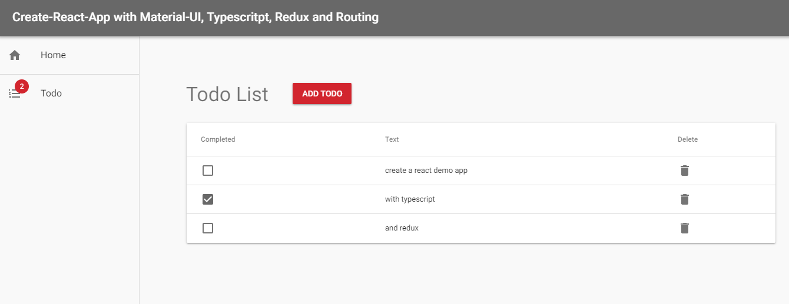

# Create React App example with Material-UI, TypeScript, Redux and Routing



Inspired by:
 * [Material-UI](https://github.com/mui-org/material-ui)
 * [react-redux-typescript-boilerplate](https://github.com/rokoroku/react-redux-typescript-boilerplate)

## Contains

- [x] [Material-UI](https://github.com/mui-org/material-ui)
- [x] [Typescript](https://www.typescriptlang.org/)
- [x] [React](https://facebook.github.io/react/)
- [x] [Redux](https://github.com/reactjs/redux)
- [x] [Redux-Thunk](https://github.com/gaearon/redux-thunk)
- [x] [Redux-Persist](https://github.com/rt2zz/redux-persist)
- [x] [React Router](https://github.com/ReactTraining/react-router)
- [x] [Redux DevTools Extension](https://github.com/zalmoxisus/redux-devtools-extension)
- [x] [TodoMVC example](http://todomvc.com)
- [ ] Hot Reloading
- [x] PWA Support

## Roadmap

- [ ] Wait for react-redux hooks
- [ ] Implement [Material-UIs new styling solution](https://material-ui.com/css-in-js/basics/) based on hooks 

See the progress on [Branch V2](https://github.com/innFactory/create-react-app-material-typescript-redux/tree/v2)

## How to use

Download or clone this repo

```bash
git clone https://github.com/innFactory/create-react-app-material-typescript-redux
cd create-react-app-material-typescript-redux
```

Install it and run:

```bash
npm i
npm start
```

## Enable PWA ServiceWorker
Just comment in the following line in the `index.tsx`:
```javascript
// registerServiceWorker();
```
to
```javascript
registerServiceWorker();
```

## The idea behind the example

This example demonstrate how you can use [Create React App](https://github.com/facebookincubator/create-react-app) with [TypeScript](https://github.com/Microsoft/TypeScript).

## Contributors

* [Anton Spöck](https://github.com/spoeck)

Powered by [innFactory](https://innfactory.de/)