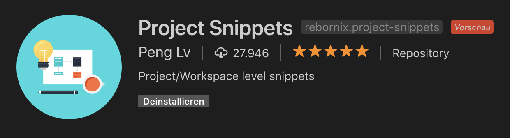
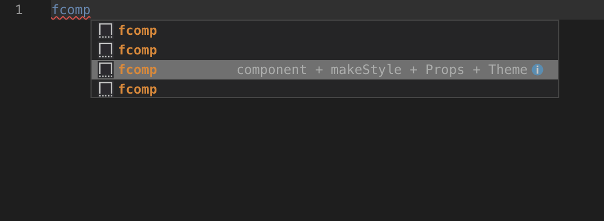
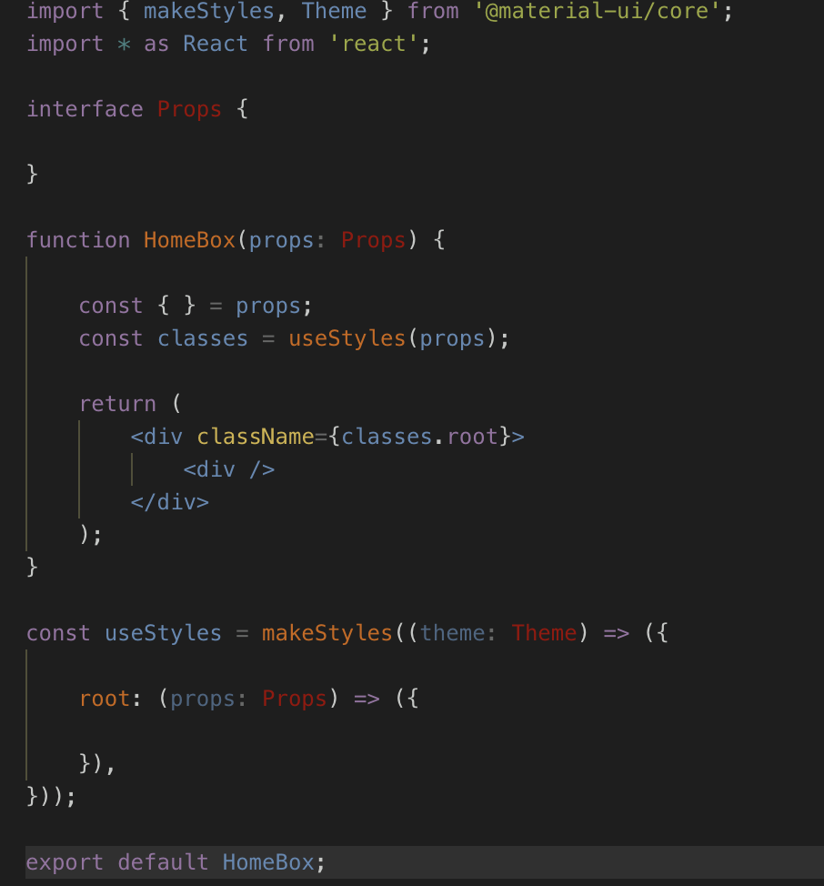

# Create React App example with Material-UI, TypeScript, Redux and Routing

This is a new version with React Hooks, Material-UI 4 and React-Redux 7 (with hooks!). We use this template for all our new projects. If you want to bootstrap a project with the classic approach without hooks but with class components, you are welcome to use the [previous version](https://github.com/innFactory/create-react-app-material-typescript-redux/tree/v1).


Inspired by:

-   [Material-UI](https://github.com/mui-org/material-ui)
-   [react-redux-typescript-boilerplate](https://github.com/rokoroku/react-redux-typescript-boilerplate)

## Contains

-   [x] [Material-UI](https://github.com/mui-org/material-ui)
-   [x] [Typescript](https://www.typescriptlang.org/)
-   [x] [React](https://facebook.github.io/react/)
-   [x] [Redux](https://github.com/reactjs/redux)
-   [x] [Redux-Thunk](https://github.com/gaearon/redux-thunk)
-   [x] [Redux-Persist](https://github.com/rt2zz/redux-persist)
-   [x] [React Router](https://github.com/ReactTraining/react-router)
-   [x] [Redux DevTools Extension](https://github.com/zalmoxisus/redux-devtools-extension)
-   [x] [TodoMVC example](http://todomvc.com)
-   [x] PWA Support

## Roadmap

-   [x] Make function based components and use hooks for state etc.
-   [x] Implement [Material-UIs new styling solution](https://material-ui.com/css-in-js/basics/) based on hooks
-   [x] use react-redux hooks
-   [ ] Hot Reloading -> Waiting for official support of react-scripts

## How to use

Download or clone this repo

```bash
git clone https://github.com/innFactory/create-react-app-material-typescript-redux
cd create-react-app-material-typescript-redux
```

Install it and run:

```bash
npm i
npm start
```

## Enable PWA ServiceWorker [OPTIONAL]

Just comment in the following line in the `index.tsx`:

```javascript
// registerServiceWorker();
```

to

```javascript
registerServiceWorker();
```

## Enable Prettier [OPTIONAL]

1.  Step: Install the Prettier plugin (e.g. the one of Esben Petersen)
2.  Add the following snippet to your settings in VSCode:

```json
    "editor.formatOnSave": true,
    "editor.codeActionsOnSave": {
       "source.organizeImports": true // optional
   },
```

## Enable project snippets [OPTIONAL]

Just install following extension:



After that you can start to type `fcomp` (_for function component_) and you get a template for a new component.




## The idea behind the example

This example demonstrate how you can use [Create React App](https://github.com/facebookincubator/create-react-app) with [TypeScript](https://github.com/Microsoft/TypeScript).

## Contributors

-   [Anton Spöck](https://github.com/spoeck)

Powered by [innFactory](https://innfactory.de/)

## Contributors

### Code Contributors

This project exists thanks to all the people who contribute. [[Contribute](CONTRIBUTING.md)].
<a href="https://github.com/innFactory/create-react-app-material-typescript-redux/graphs/contributors"></a>

### Financial Contributors

Become a financial contributor and help us sustain our community. [[Contribute](https://opencollective.com/start-react-typescript/contribute)]

#### Individuals

<a href="https://opencollective.com/start-react-typescript"></a>

#### Organizations

Support this project with your organization. Your logo will show up here with a link to your website. [[Contribute](https://opencollective.com/start-react-typescript/contribute)]

<a href="https://opencollective.com/start-react-typescript/organization/0/website"></a>
<a href="https://opencollective.com/start-react-typescript/organization/1/website"></a>
<a href="https://opencollective.com/start-react-typescript/organization/2/website"></a>
<a href="https://opencollective.com/start-react-typescript/organization/3/website"></a>
<a href="https://opencollective.com/start-react-typescript/organization/4/website"></a>
<a href="https://opencollective.com/start-react-typescript/organization/5/website"></a>
<a href="https://opencollective.com/start-react-typescript/organization/6/website"></a>
<a href="https://opencollective.com/start-react-typescript/organization/7/website"></a>
<a href="https://opencollective.com/start-react-typescript/organization/8/website"></a>
<a href="https://opencollective.com/start-react-typescript/organization/9/website"></a>
